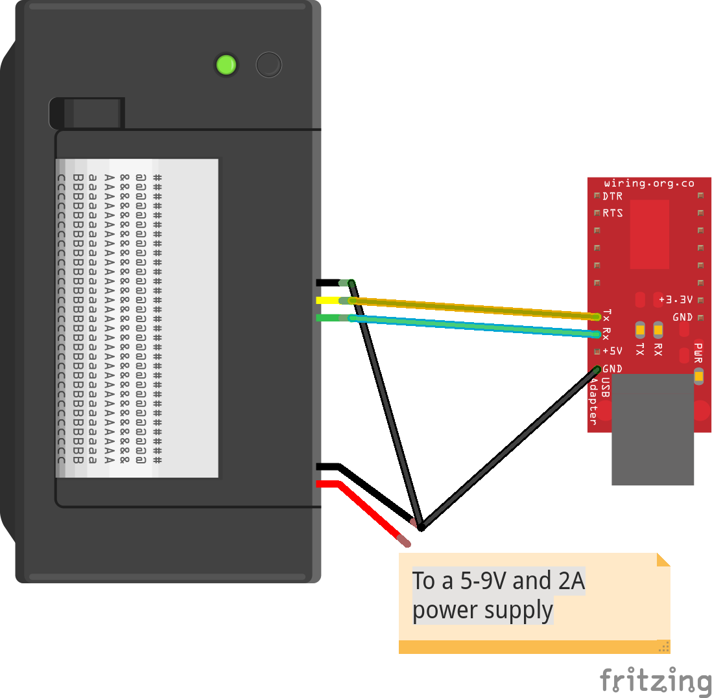

storyprinter
============
Simple application, overkill stack as a learning exercise: react + next.js + graphql (and rpi + thermal printer)

TODO
----
+ preinstall.sh to install armv7 phantomjs binaries on pi
+ printRender page
+ test phantomjs manually
- figure out simple rest API to trigger server rendering w/ phantonjs
+ mock JSON API
  - https://hook.io/100ideas/fakerjs-storyprinter
  - https://gist.github.com/100ideas/912eced936c08276b5ff42239b9d1c15
- mock graphql API
  - https://github.com/APIs-guru/graphql-faker
  - probably faster just to stub it out

notes
-----
- next v3.0beta
  - fixes trailing slash problem in urls ?
    - https://github.com/zeit/next.js/blob/v3-beta/lib/router/index.js#L100
  - how to use postcss + webpack + babel + next.config.js to load css
    - https://github.com/zeit/next.js/tree/v3-beta/examples/with-global-stylesheet
  - or wrap with styled-jsx
    - https://github.com/zeit/next.js/blob/v3-beta/examples/with-apollo/components/App.js


Thermal Printer Specs
---------------------
"Cashino" A2 Micro Pannel Thermal Printer -  [Adafruit](https://learn.adafruit.com/mini-thermal-receipt-printer?view=all)
- 8 dots/mm
- 384 dots/line (~203 DPI)
- effective printing width: 48mm
- paper type: 57.5± 0.5mm (effectively [ISO 216 C8](https://en.wikipedia.org/wiki/ISO_216#Dimensions_of_A.2C_B_and_C_Series) width-wise)
- paper roll max diameter: 39mm
- power: DC5V-9V
- interface: Serial(RS-232,TTL), Parallel
- [product sheet](http://www.adafruit.com/datasheets/cashino%20thermal%20printer%20a2.pdf), [user manual](https://cdn-shop.adafruit.com/datasheets/CSN-A2+User+Manual.pdf)


Thermal Printer Technical Resources
-----------------------------------
- [Adafruit: Minhttps://github.com/100ideas/storywall/edit/master/README.mdi Thermal Receipt Printer Overview](https://learn.adafruit.com/mini-thermal-receipt-printer?view=all)
- [Adafruit: Thermal Printer + pi "instant camera"](https://learn.adafruit.com/instant-camera-using-raspberry-pi-and-thermal-printer?view=all)
- [**adafruit/Python-Thermal-Printer**: ](https://github.com/adafruit/Python-Thermal-Printer)
  > "This is a Python library for the Adafruit Thermal Printer. These printers use TTL serial to communicate, 2 pins are required. IMPORTANT: On 3.3V systems (e.g. Raspberry Pi), use a 10K resistor on the RX pin (TX on the printer, green wire), or simply leave unconnected."
- [**adafruit/zj-58**: CUPS filter for thermal printer Zjiang ZJ-58](https://github.com/adafruit/zj-58)
- [**xseignard/thermalPrinter**: Use node.js to communicate with Adafruit/Sparkfun Thermal Printer](https://github.com/xseignard/thermalPrinter)
- [pbm2lwxl - A driver for the Dymo/CoStar/Avery Label printers](http://web.archive.org/web/20101021114259/http://www.freelabs.com/~whitis/software/pbm2lwxl/) (questionable utility?)
  > "pbm2lwxl is a device driver for the CoStar Labelwriter XL and compatible printers. It takes plain (not raw) pbm files. The PBM file format was popularized by the PBM (aka netbpm, pbmplus, etc) utilities by Jef Poskanzer. There are utilities to convert from almost any image format to PBM/PPM/PGM/PNM, and vice versa. Ghostscript supports pbm output."
- [Setting up serial port rx/tx w/ printer](https://electronicfields.wordpress.com/2011/09/29/thermal-printer-dot-net/)
  

Provisioning Pi (WiP)
---------------------
- https://www.raspberrypi.org/documentation/configuration/wireless/wireless-cli.md
- http://thisdavej.com/beginners-guide-to-installing-node-js-on-a-raspberry-pi/#install-node
- https://yarnpkg.com/en/docs/install#linux-tab

```bash
# *interactive* configure keyboard, hostname, expand fs etc
raspi-config

# *interactive* configure wifi
sudo iwlist wlan0 scan | grep <ssid>
wpa_passphrase <ssid> <ssid-password> | sudo tee -a /etc/wpa_supplicant/wpa_supplicant.conf > /dev/null

# to configure wpa-roam for multiple wifi networks
# https://www.thepolyglotdeveloper.com/2016/08/connect-multiple-wireless-networks-raspberry-pi/

# system upgrade (~30min on rpi2)
sudo apt-get update && time sudo apt-get dist-upgrade

# get node packages
curl -sL https://deb.nodesource.com/setup_7.x | sudo -E bash -

# get yarn packages
curl -sS https://dl.yarnpkg.com/debian/pubkey.gpg | sudo apt-key add -
echo "deb https://dl.yarnpkg.com/debian/ stable main" | sudo tee /etc/apt/sources.list.d/yarn.list

# 15 min big install (may need nice; need g++ if latest not already installed)
time sudo apt-get update && time sudo apt-get install -y nodejs yarn libcups2-dev libcupsimage2-dev cups cups-client

# setup dirs
sudo mkdir /opt/thermprint
sudo chown pi:www-data /opt/thermprint
cd /opt/thermprint
git clone https://github.com/adafruit/zj-58.git

sudo mkdir /opt/storywall
sudo chown pi:www-data /opt/storywall
cd /opt
git clone https://github.com/100ideas/storywall.git storywall
```


## chrome headless

chromium command line switches
http://peter.sh/experiments/chromium-command-line-switches/
consider
- --disable-2d-canvas-clip-aa ⊗	Disable antialiasing on 2d canvas clips ↪
- --disable-canvas-aa ⊗	Disable antialiasing on 2d canvas. ↪
- --disable-composited-antialiasing ⊗	Disables layer-edge anti-aliasing in the compositor. ↪
- OS_WIN only -disable-directwrite-for-ui[1] ⊗	Disables DirectWrite font rendering for general UI elements. ↪
- enable-harfbuzz-rendertext - // Enables the HarfBuzz port of RenderText on Mac (it's already used only for text editing; this enables it for everything else).
	https://cs.chromium.org/chromium/src/ui/gfx/switches.cc?q=kDisableDirectWriteForUI&sq=package:chromium&type=cs&l=12

- --enable-low-end-device-mode ⊗	Force low-end device mode when set.
- --enable-consumer-kiosk ⊗	Enables consumer kiosk mode for Chrome OS


```
alias chrome-canary "/Applications/Google\ Chrome\ Canary.app/Contents/MacOS/Google\ Chrome\ Canary"

chrome-canary http://localhost:3000/rasterize --headless --screenshot --window-size=384,700 --disable-direct
```

Arcane Pi config Resources
--------------------------

### chromium-browser kiosk mode
https://github.com/CODESIGN2/rpi-pixel-kiosk

also see
https://www.danpurdy.co.uk/web-development/raspberry-pi-kiosk-screen-tutorial/

### learn system and shell basics (debian)
https://www.debian.org/doc/manuals/debian-reference/

### images in terminal
- 'fbi' package displays images in terminal
  - http://www.instructables.com/id/Raspberry-Pi-Wall-Display-Without-X-Windows/
- 'hiptext'


### locales
```
$ sudo locale-gen "en_US.UTF-8"
Generating locales...
  en_US.UTF-8... done
Generation complete.

$ sudo dpkg-reconfigure locales
Generating locales...
  en_US.UTF-8... up-to-date
Generation complete.
```

### raspi-config
http://elinux.org/RPiconfig

> As the Raspberry Pi doesn't have a conventional BIOS, the various system configuration parameters that would normally be kept and set using the BIOS are now stored in a text file named "config.txt".
>
> The Raspberry Pi config.txt file is read by the GPU before the ARM core is initialized.
>
> This file is an optional file on the boot partition. It would normally be accessible as /boot/config.txt from Linux, but from Windows (or OS X) it would be seen as a file in the accessible part of the card.

```
vcgencmd get_config <config> - lists a specific config value. E.g. vcgencmd get_config arm_freq
vcgencmd get_config int - lists all the integer config options that are set (non-zero)
vcgencmd get_config str - lists all the string config options that are set (non-null)
```


### storywall printer hacking - obsolete
-------------------------

make thermal printer CUPS printer default
https://learn.adafruit.com/instant-camera-using-raspberry-pi-and-thermal-printer?view=all#install-software

# check /var/log/cups/error_log if problems installing
```
cd /opt/thermprint
git clone https://github.com/adafruit/zj-58
cd zj-58
make
sudo ./install
```

```
sudo lpadmin -p ZJ-58 -E -v serial:/dev/ttyAMA0?baud=19200 -m zjiang/ZJ-58.ppd
sudo lpoptions -d ZJ-58
```

```
$ sudo lpoptions -d ZJ-58
copies=1 device-uri=serial:/dev/ttyAMA0?baud=19200 finishings=3 job-hold-until=no-hold job-priority=50 job-sheets=none,none marker-change-time=0 number-up=1 printer-commands=none printer-info=ZJ-58 printer-is-accepting-jobs=true printer-is-shared=true printer-location printer-make-and-model='Zijiang ZJ-58' printer-state=3 printer-state-change-time=1495505009 printer-state-reasons=none printer-type=20484 printer-uri-supported=ipp://localhost:631/printers/ZJ-58
```

```
sudo apt-get install python-pip
sudo apt-get install python-PIL
sudo pip install PySerial

# adafruit python lib
pi@storywall:/opt/thermprint/Python-Thermal-Printer $ pdfinfo demo.pdf
Title:
Creator:
Producer:       Qt 5.5.1
CreationDate:   Tue May 23 02:38:51 2017
Tagged:         no
UserProperties: no
Suspects:       no
Form:           none
JavaScript:     no
Pages:          1
Encrypted:      no
Page size:      384 x 900 pts
Page rot:       0
File size:      50622 bytes
Optimized:      no
PDF version:    1.4
```
